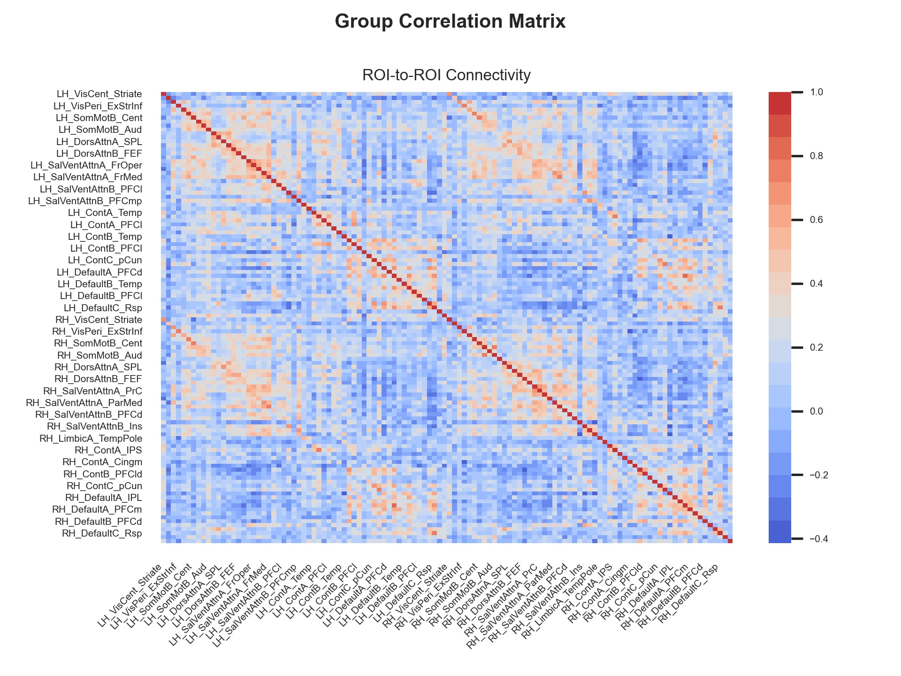

# afni_pairwise_conn package
Create a pairwise (roi-to-roi) functional connectivity matrix using AFNI and Python.

## Change Log
[Change Log for this project](./CHANGELOG.md)

## Instructions
[Instructions for this project](./instructions.md)

## Example Output

